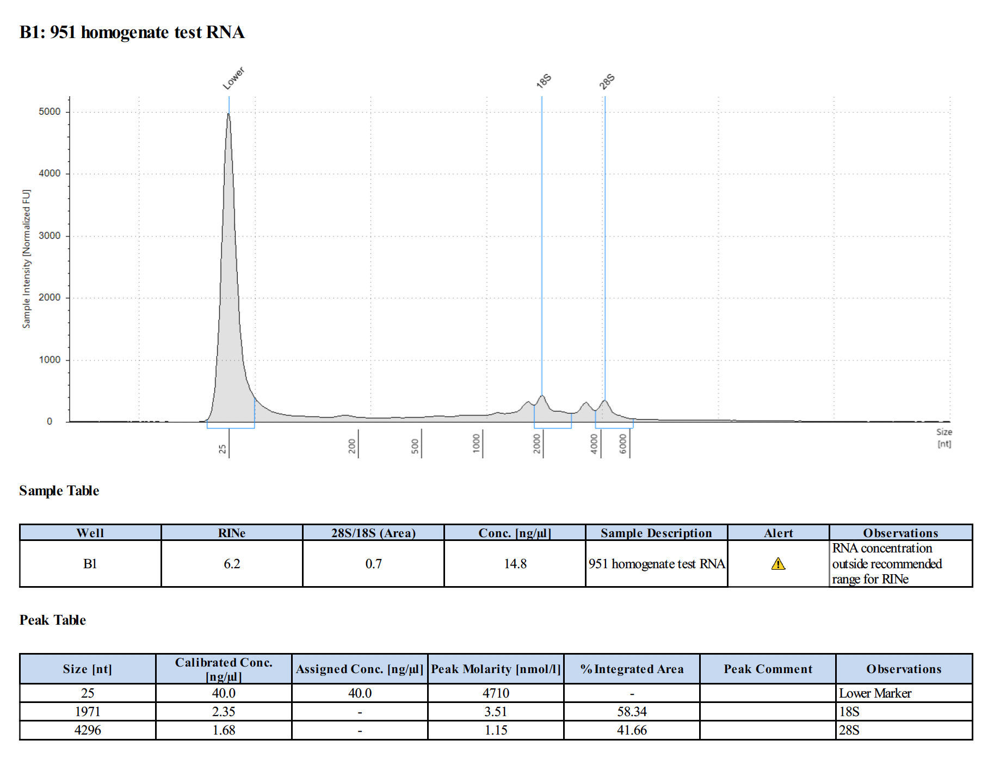
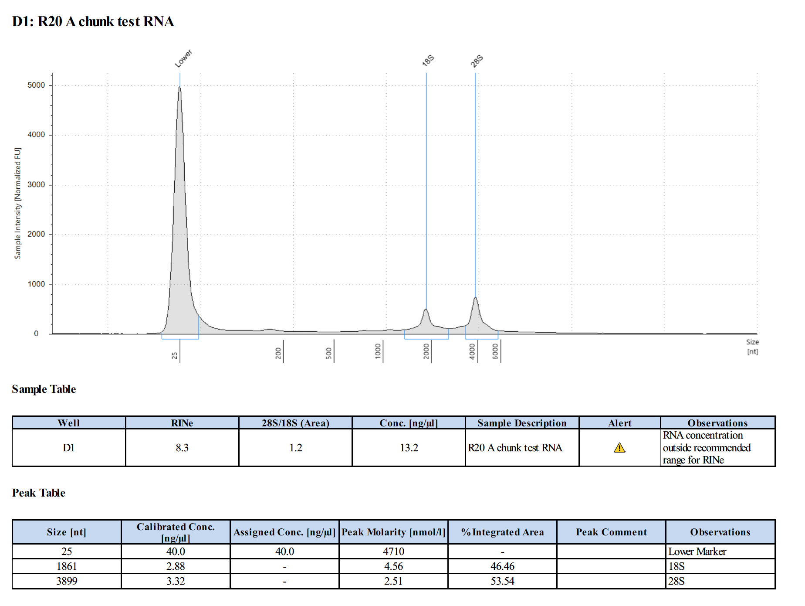

# ZYMO Quick-DNA/RNA Miniprep Plus Kit Troubleshooting

## Goal
* To determine if both DNA and RNA extracts can be obtained from an adult coral homogenate (see [airbrushing protocol](https://hputnam.github.io/Putnam_Lab_Notebook/Coral_Tissue_Removal_protocol/)) and a biopsy of adult tissue and skeleton. The coral used for this test was *Porites astreoides* collected from Bermuda.

## Experimental design
Table 1: Experimental Design to test DNA/RNA extraction methods on 2 types of coral tissues.

| Sample # | Sample Type | Coral ID/Vial# | Volume/Size of Sample |
|:--------:|:-----------:|:--------------:|:---------------------:|
|     1    |  Homogenate |       951      |         500 mL        |
|     2    |  Homogenate |       954      |         500 mL        |
|     3    |   Fragment  |      R20-A     |     ~10 mm diameter   |
|     4    |   Fragment  |      R20-A     |     ~10 mm diameter   |

#### Overall workflow
1. Prepare samples
2. Extract and prep DNA with column (elute RNA and Protein)
3. Extract and prep RNA with column (elute Protein)
4. Quantify DNA, RNA, and protein extracts

## Protocol preparation

* Using slightly modified [Zymo Duet DNA/RNA extraction protocol](https://www.zymoresearch.com/media/amasty/amfile/attach/_D7003_ZR-Duet_DNA-RNA_MiniPrep_Plus_ver_1.0.1.pdf) which will extract both DNA and RNA at the same time (Below are summary steps)

#### Reagents and supplies
* RNase-free Water
* 100% ethanol, ACS grade or better
* 10mM Tris HCl pH 8.0 made with RNase-free water
* ZR BBashing lysis tubes with 0.1mm and 0.5mm beads

#### Equipment
* Rocking oven that can be set to 55°C
* RNase away and a designated RNase free space
* Tabletop and larger centrifuges for 1.5mL and 50mL tubes capable of 12,000 x g

#### Clipper Sterilization
* Rub down clippers with:
  1. 10% Bleach solution
  2. DI water
  3. 90% ethanol
  4. RNAse free water

#### Notes before starting
* Wipe down benchtop with RNase away and have the spray bottle and kimwipes on-hand to use frequently

## Sample preparation

#### Homogenate preparation
* Immediately after taking sample out of the -80&deg;C freezer, add 500&mu;L of DNA/RNA shield
* Add 100 &mu;L of Protenase K digestion buffer
  * Derived from volume of homogenate and 300/30 ratio from Zymo Protocol
* Add 50 &mu;L of Protenase K
  * Derived from volume of homogenate and 300/15 ratio from Zymo Protocol
* Incubate on Thermomixer at 56&deg;C at 600 rpm for 30 minutes
* Remove all liquid (1150 &mu;L) and transfer in 5 mL tubes

#### Fragment preparation
* Sterilize clippers (as outlined above)
* Clip off ~10mm in diameter of tissue and skeleton and place into ZR BBashing lysis tube
* Add 1000 &mu;L of DNA/RNA shield (may be too much)
* Vortex for ~1 minute
* Remove 500 &mu;L of supernatant and transfer into 5mL tube
  * Large mucus chunks made this step difficult --> potential source of error

## DNA Extraction
1. Add equal volumes of DNA lysis buffer as sample volume to the 5 mL tube with sample
  * 1150 &mu;L for the homogenate samples
  * 500 &mu;L for the fragment samples
  * Vortex to mix
2. Transfer 700 &mu;L into DNA filter column (yellow)
  * Centrifuge at 16,000 rcf for 30 seconds
  * Remove flow through liquid and transfer into a new 5 mL tube labeled for RNA
3. Repeat steps 2 until all liquid is gone
4. Add 400 &mu;L of DNA/RNA prep buffer to column
  * Centrifuge at 16,000 rcf for 30 seconds
  * Remove the flow through and transfer to waste
5. Add 700 &mu;L of DNA/RNA wash buffer
  * Centrifuge at 16,000 rcf for 30 seconds
  * Remove the flow through and transfer to waste
6. Add 400 &mu;L of DNA/RNA wash buffer
  * Centrifuge at 16,000 rcf for 2 minutes
  * Remove the flow through and transfer to waste
7. Removed column and place into a new sterile 1.5 mL tube
8. Add 50 &mu;L of 10 mM Tris HCL (warmed to 55&deg;C) directly to filter
  * Incubate at room temperature for 5 minutes
  * Centrifuge at 16,000 rcf for 30 seconds
  * Keep flow through in tube
9. Add another 50 &mu;L of 10 mM Tris HCL (warmed to 55&deg;C) directly to filter
  * Incubate at room temperature for 5 minutes
  * Centrifuge at 16,000 rcf for 30 seconds
  * Discard column and keep flow through in tube
10. Aliquot into appropriate tubes for storage at -20&deg;C

## RNA Extraction
11. Add equal volumes of 100% Ethanol as sample volume to the 5 mL tube with sample
  * 1150 &mu;L for the homogenate samples
  * 500 &mu;L for the fragment samples
  * Vortex to mix
12. Transfer 700 &mu;L into RNA filter column (green)
  * Centrifuge at 16,000 rcf for 30 seconds
  * Remove flow through liquid and transfer into a new 5 mL tube labeled for Protein
13. Repeat steps 12 until all liquid is gone
14. Add 400 &mu;L of DNA/RNA wash buffer to column
  * Centrifuge at 16,000 rcf for 30 seconds
  * Remove the flow through and transfer to waste
15. Make DNase I master mix: [75μL DNA digestion buffer and 5μL DNase] X n (sample #)
16. Add 80μL of DNase I master mix directly to the filter of each column. Incubate at room temperature for ~15 minutes
17. Add 400 &mu;L of DNA/RNA prep buffer to column
  * Centrifuge at 16,000 rcf for 30 seconds
  * Remove the flow through and transfer to waste
18. Add 700 &mu;L of DNA/RNA wash buffer
  * Centrifuge at 16,000 rcf for 30 seconds
  * Remove the flow through and transfer to waste
19. Add 400 &mu;L of DNA/RNA wash buffer
  * Centrifuge at 16,000 rcf for 2 minutes
  * Remove the flow through and transfer to waste
20. Removed column and place into a new sterile 1.5 mL tube
21. Add 50 &mu;L of RNAase-free water (warmed to 55&deg;C) directly to filter
  * Incubate at room temperature for 5 minutes
  * Centrifuge at 16,000 rcf for 30 seconds
  * Keep flow through in tube
22. Add another 50 &mu;L of RNAase-free water (warmed to 55&deg;C) directly to filter
  * Incubate at room temperature for 5 minutes
  * Centrifuge at 16,000 rcf for 30 seconds
  * Discard column and keep flow through in tube
23. Aliquot into appropriate tubes for storage at -80&deg;C

## Quantification

### Qubit

* For the Qubit readings, 10 &mu;L of each standard were used and 1 &mu;L of each sample were used.

Table 2: Qubit readings for the extracted DNA and RNA samples.

|     | Standard 1 | Standard 2  | #1 (ng/uL) | #2 (ng/uL) | #3 (ng/uL) | #4 (ng/uL) |
|:---:|:----------:|:-----------:|:----------:|:----------:|:----------:|:----------:|
| DNA |   205.05   |   22675.65  |    16.70   |    13.00   |    8.24    |    3.03    |
| DNA |     NA     |      NA     |    16.10   |    13.00   |    8.10    |    2.98    |
| RNA |   393.14   |   11692.94  |    10.20   |    11.80   |    12.60   |   Too low  |
| DNA |     NA     |      NA     |    10.00   |    11.60   |    12.40   |   Too low  |

### Tapestation
* Only RNA samples were run on the tape station
* Due to the low sample reading from sample #4, it was not run on the tapestation

#### Tapestation results
Sample 1:

Sample 2:

Sample 3:

## Conclusions
* Homogenates from airbrushed coral tissue can only be used for DNA, RNA is too degraded
* Need to troubleshoot homogenizing coral fragment with beadbeating, but it is possible to extract RNA using this protocol
